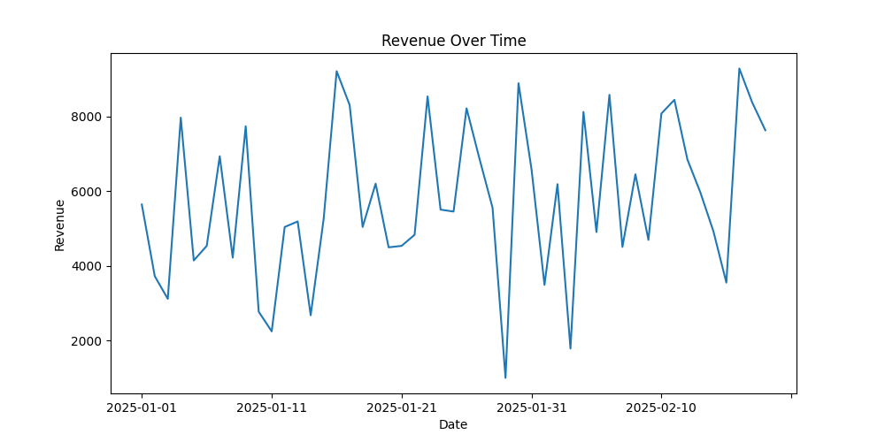
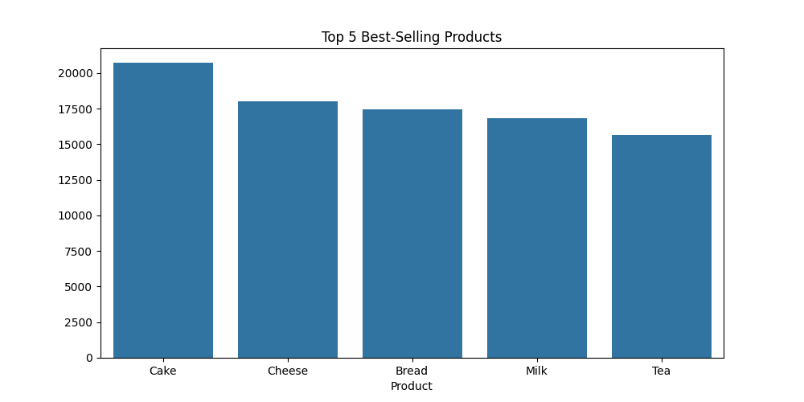

### ✅ **Check: Repository Structure**
sales-analysis-project/
│── data/
│   ├── sales_data.csv  # Sample sales dataset
│   ├── cleaned_sales_data.csv  # Processed dataset (Generated)
│   ├── best_sellers.csv  # Output from analysis.py (Generated)
│   ├── daily_sales.csv  # Output from analysis.py (Generated)
│   ├── revenue_trend.png  # Visualization output (Generated)
│   ├── top_products.png  # Visualization output (Generated)
│── scripts/
│   ├── data_cleaning.py  # Cleans the dataset
│   ├── analysis.py  # Performs exploratory data analysis
│   ├── visualization.py  # Generates visual reports
│── dashboard/
│   ├── app.py  # Streamlit dashboard for insights
│── README.md  # Project documentation (You need to add this)
│── requirements.txt  # Dependencies
```

---

### 📜 **README.md File**  


```md
# 📊 Sales Data Analysis & Insights Dashboard  

## 🚀 Overview  
This project analyzes sales data from a retail store to generate key business insights. It includes:  
- Data Cleaning & Preprocessing  
- Exploratory Data Analysis (EDA)  
- Sales Insights & Trends  
- An Interactive Dashboard using **Streamlit**  

---

## 📂 Project Structure  
```md`
sales-analysis-project/
│── data/                     # Contains datasets & generated outputs
│── scripts/                  # Python scripts for data processing
│── dashboard/                 # Interactive Streamlit dashboard
│── README.md                  # Project documentation
│── requirements.txt           # List of dependencies
```

---

## 🔧 Setup Instructions  

### 1️⃣ **Clone the Repository**  
```sh
git clone https://github.com/your-username/sales-analysis-project.git
cd sales-analysis-project
```

### 2️⃣ **Install Dependencies**  
Ensure you have **Python 3.8+** installed, then run:  
```sh
pip install -r requirements.txt
```

### 3️⃣ **Run Data Cleaning & Analysis Scripts**  
```sh
python scripts/data_cleaning.py   # Cleans & preprocesses data  
python scripts/analysis.py        # Performs exploratory analysis  
python scripts/visualization.py   # Generates charts  
```

### 4️⃣ **Launch Interactive Dashboard**  
```sh
streamlit run dashboard/app.py
```
This will open a web-based dashboard showing key insights.

---

## 📊 Features  

### ✅ **Data Cleaning** (`scripts/data_cleaning.py`)  
- Converts date formats, removes duplicates, and fills missing values  
- Adds new metrics like **Profit Margin %**  

### 📈 **Exploratory Data Analysis (EDA)** (`scripts/analysis.py`)  
- Analyzes **top-selling products** & **sales trends**  
- Saves insights into CSV files  

### 📊 **Data Visualization** (`scripts/visualization.py`)  
- Generates visual reports (Revenue Trends, Top Products)  

### 🖥 **Interactive Dashboard** (`dashboard/app.py`)  
- Displays **total revenue, best-sellers, store-wise revenue**  
- Uses **Streamlit** to create dynamic charts  

---

## 📸 Sample Visuals  
### 🔹 Revenue Trend Over Time  
  

### 🔹 Top 5 Best-Selling Products  
  

---

## 🛠 Technologies Used  
- **Python** (Data Processing & Analysis)  
- **Pandas, NumPy** (Data Manipulation)  
- **Matplotlib, Seaborn** (Data Visualization)  
- **Streamlit** (Interactive Dashboard)  
- **Jupyter Notebook** (Optional for analysis)  

---

## 👨‍💻 Contributing  
Feel free to fork this repo, submit issues, or contribute! 🚀  

---

## ⚡ Author  
Created by [Venkatakrishna Sharma Tharanikanti]  
GitHub: [https://github.com/VkTharanikanti]  
LinkedIn: [http://linkedin.com/Vktharanikanti]  